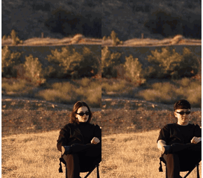
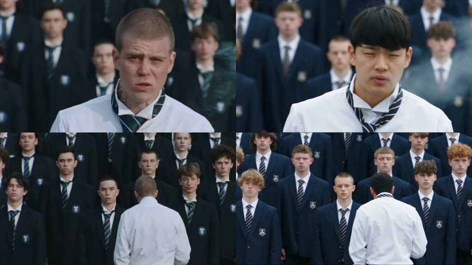

# 밈 제너레이터 (video-meme-generator)

**밈 영상 하나와 내 사진(또는 캐릭터 시트)을 넣으면, 영상 속 주인공이 내가 된 밈이 나옵니다.**

Claude Code 안에서 `이 영상에 나 넣어줘 <영상 주소>` 한 줄이면 끝까지 알아서 만듭니다. 영상 분석, 누구를 바꿀지 캐스팅,
필요하면 영상에 맞는 옷 입히기, [Higgsfield Genjutsu](https://docs.higgsfield.ai/docs/models/genjutsu) 프롬프트 작성과 검사,
결과 검수, 원본 소리 복원까지 합니다. 편집 프로그램은 한 번도 켜지 않습니다.

<p align="center">
  
</p>
<p align="center">
  소리까지 보기: <a href="docs/example/before.mp4">원본 (12.0초)</a> · <a href="docs/example/after.mp4">결과 (12.0초)</a>
</p>

- **묻는 건 딱 한 번, 돈 얘기뿐입니다.** 영상을 받으면 "4초 테스트 먼저 / 바로 전체 / 생성 직전까지만" 을 예상 비용과 함께 한 번 묻고, 그다음은 끝까지 알아서 합니다.
- **싸게 먼저 확인합니다.** 테스트를 고르면 영상에서 4초만 잘라 480p로 한 번 돌려 봅니다(약 $1.3, 또는 12 크레딧). 얼굴이 제대로 바뀌면 그때 전체를 만듭니다.
- **원본 길이 그대로.** 영상을 자르지 않습니다(최대 30초). 끝이 잘리지 않게 정수 초로 맞춰 보내고, 마지막에 원래 길이로 되돌립니다.
- **실제로 부딪힌 함정을 알고 있습니다.** 80번 넘게 돌려 보며 알아낸 것(어느 모드가 얼굴형을 바꾸는지, 얼굴 차이가 클 때 프롬프트를 어떻게 쓰는지, 검열에 걸리는 말)이 스킬과 [docs/pitfalls.md](docs/pitfalls.md), [docs/findings.md](docs/findings.md) 에 들어 있습니다.

> 📖 **처음이라면 [사용 매뉴얼](docs/MANUAL.md)** 부터 보세요. 스킬 소개와 원리, 온보딩, Codex 이미지 생성 가이드가 한 문서에 있습니다(노션에 그대로 가져올 수 있는 마크다운).

> 📚 **교육용으로 만든 프로젝트입니다.** Claude Code에 스킬·검사·작업 폴더를 붙여, 돈이 드는 AI 영상 생성을 끝까지 맡기는 방법을 보여 주려고 만들었습니다. 뜯어보고 고쳐 쓰면서 배우라고 공개합니다. 만든 과정은 유튜브 [@ai.sam_hottman](https://www.youtube.com/@ai.sam_hottman) 에서 소개합니다.

---

## 빠른 시작

### 1. 준비물

가벼운 파이썬 CLI 하나와 스킬 문서뿐이라 **Windows · macOS · Linux 어디서나 그대로** 돌아갑니다. 무거운 모델이나 GPU는 필요 없습니다(영상 생성은 Higgsfield 서버에서 합니다).

| | Windows (PowerShell) | macOS | 확인 |
|---|---|---|---|
| [Claude Code](https://claude.com/claude-code) (Claude 유료 요금제 필요) | 사이트 안내대로 설치 ([Git for Windows](https://git-scm.com/download/win) 도 함께) | 사이트 안내대로 설치 | `claude --version` |
| [uv](https://docs.astral.sh/uv/) (파이썬 관리, 파이썬도 알아서 받음) | `winget install astral-sh.uv` | `brew install uv` | `uv --version` |
| [ffmpeg](https://ffmpeg.org) | `winget install Gyan.FFmpeg` | `brew install ffmpeg` | `ffmpeg -version` |
| [Higgsfield](https://higgsfield.ai) 계정 | 영상 생성에 필요. 아래 [API 연결](#2-api-연결-둘-중-하나) 참고 | | |
| **[Codex CLI](https://github.com/openai/codex) (이미지 생성, 추천)** | `winget install OpenJS.NodeJS.LTS` → `npm i -g @openai/codex` → `codex login` | `brew install node` → 같음 | `codex login status` |

Linux는 `curl -LsSf https://astral.sh/uv/install.sh | sh`, `sudo apt install ffmpeg` 입니다. 이미지 생성은 **Codex CLI를 추천**합니다(아래 [이미지 생성](#이미지-생성은-codex-cli-추천)). ChatGPT 계정으로 로그인하면 API 키 없이 쓸 수 있습니다.

> **Windows**: `winget` 으로 설치한 뒤에는 **터미널을 새로 열어야** `uv`, `ffmpeg` 가 잡힙니다.

```bash
git clone https://github.com/hotorch/video-meme-generator.git
cd video-meme-generator
uv sync
uv run memegen doctor
```

Windows PowerShell, macOS 터미널 모두 같은 명령입니다. `uv sync` 가 필요한 파이썬과 패키지를 `.venv` 에 받습니다(1분 안쪽).

`doctor` 결과에서 `ffmpeg`, `ffprobe` 가 `true` 면 설치는 끝입니다. `generation` 줄이 영상 생성을 어느 쪽으로 할지 알려 줍니다.

### 2. API 연결 (둘 중 하나)

Genjutsu는 두 가지 방법으로 부를 수 있습니다. 결과는 같고, **돈을 내는 곳**만 다릅니다.

| | A. Higgsfield MCP (추천) | B. REST API 키 |
|---|---|---|
| 결제 | higgsfield.ai 구독 **크레딧**에서 차감 | API 잔액에서 **쓴 만큼** 결제 (구독과 별개) |
| 준비 | Claude에 커넥터 추가 + 로그인 | 키 만들어서 `.env` 에 붙여 넣기 |
| 생성 | Claude가 MCP로 올리고·보내고·받습니다 | `memegen render` 가 전부 합니다 |
| 4초 테스트 | 12 크레딧 | $1.27 |

#### A. Higgsfield MCP 커넥터 (구독 크레딧 사용)

1. [higgsfield.ai](https://higgsfield.ai) 에 가입하고 요금제를 고릅니다. 크레딧이 있어야 생성됩니다.
2. Claude에 커넥터를 추가합니다. 둘 중 편한 쪽으로 하세요.
   - **claude.ai / Claude 데스크톱 앱**: 설정 → 커넥터(Connectors) → 사용자 지정 커넥터 추가 → 이름 `Higgsfield`, 주소 `https://mcp.higgsfield.ai/mcp` → 연결을 누르고 higgsfield.ai 계정으로 로그인합니다. 같은 Claude 계정으로 로그인한 Claude Code에서도 이 커넥터가 보입니다.
   - **Claude Code 터미널**:
     ```bash
     claude mcp add --transport http higgsfield https://mcp.higgsfield.ai/mcp
     ```
     그다음 `claude` 를 켜고 `/mcp` 에서 higgsfield 를 골라 로그인합니다.
3. Claude에게 "힉스필드 잔액 알려줘" 라고 해서 크레딧이 보이면 연결된 것입니다.

> 웹 요금제의 "무제한" 혜택은 MCP 호출에는 적용되지 않습니다. MCP로 만든 영상도 크레딧이 차감됩니다.

#### B. REST API 키 (쓴 만큼 결제)

1. [console.higgsfield.ai](https://console.higgsfield.ai) 에 로그인해서 API 키를 만듭니다. `KEY_ID` 와 `KEY_SECRET` 두 값이 나옵니다.
2. 콘솔에서 API 잔액을 충전합니다. 구독 크레딧과는 따로입니다.
3. 키를 `.env` 에 넣습니다. 예시 파일을 복사합니다(Windows PowerShell 에서도 같은 명령입니다).
   ```bash
   cp .env.example .env
   ```
   `.env` 를 메모장 등으로 열어 `HF_KEY=KEY_ID:KEY_SECRET` 형식으로 붙여 넣습니다(가운데 콜론 하나). `.env` 는 git에 올라가지 않습니다.
4. `uv run memegen doctor` 의 `generation` 이 `REST API ready` 면 끝입니다.

둘 다 설정돼 있으면 REST를 먼저 씁니다. MCP로 하고 싶으면 Claude에게 "MCP로 만들어줘" 라고 하면 됩니다.

### 3. 온보딩 (한 번만, 10분)

같은 폴더에서 Claude Code를 켜고 이렇게 말합니다.

```bash
claude
```
```
온보딩 해줘
```

`meme-onboarding` 스킬이 다섯 단계로 안내합니다.

| 단계 | 하는 일 |
|---|---|
| 1/5 설치 확인 | `doctor` 결과를 보고 빠진 것을 OS에 맞게 설치 |
| 2/5 영상 생성 연결 | MCP 커넥터나 REST 키 중 하나가 동작하는지 확인 |
| 3/5 내 캐릭터 등록 | 사진·캐릭터 시트를 받아 한 사람만 나오게 잘라 `assets/characters/` 에 등록. 키·체형을 물어 기록 |
| 4/5 더 넣을 캐릭터 (선택) | 반려동물, 허락받은 친구, 자주 쓸 사물 |
| 5/5 기본값 저장 | 생성 방식(매번 묻기/항상 테스트 먼저/항상 바로), 해상도, 두 번째 인물 처리를 한 번에 물어 **Claude 메모리**와 `.env` 에 저장 |

사진은 정면 얼굴이 크게 나온 사진 1장과 여러 각도가 담긴 깨끗한 시트 1장(또는 사진 3~5장)이 가장 좋습니다. 파일을 Claude 창에 끌어다 놓거나 경로를 붙여 넣으면 됩니다(Windows는 탐색기에서 복사한 경로 그대로).
`assets/` 안의 사진·캐릭터는 모두 **내 컴퓨터에만** 있고 git에 올라가지 않습니다.
저장된 기억 덕분에 다음부터는 캐릭터나 기본값을 다시 묻지 않습니다.

### 4. 밈 만들기

```
이 영상에 나 넣어줘 https://www.youtube.com/shorts/XXXXXXXX
왼쪽에 의자에 앉은 사람 = 나
```

영상을 받자마자 **한 번만** 이렇게 묻습니다.

```
chair-jump (12초) 생성 방식을 골라 주세요
  1. 테스트 먼저 (추천)  — 4초만 480p로 한 번 (≈$1.27 / 12 크레딧). 괜찮으면 묻지 않고 바로 전체 생성
  2. 바로 전체 생성      — 원본 12초, 720p (≈$8.85 / 91 크레딧)
  3. 생성 직전까지만     — 분석·캐스팅·프롬프트까지만 준비 (비용 0)
```

고르고 나면 끝까지 알아서 갑니다. 완성본은 `work/<날짜-이름>/05_final/<이름>.mp4` 에 저장되고, 마지막에 무엇을 왜 정했는지와 쓴 비용을 알려 줍니다.
생성 대기열이 길면 한 편에 10~40분 걸립니다.

> **매번 묻는 것도 싫다면** `.env` 에 `MEMEGEN_RUN_PLAN=probe-first` (또는 `full`) 를 넣으세요. 그 뒤로는 묻지 않습니다.

---

## 이미지 생성은 Codex CLI (추천)

영상 생성은 Higgsfield Genjutsu가 하지만, 그 앞에 필요한 **이미지**는 [Codex CLI](https://github.com/openai/codex)로 만듭니다.
내 사진을 레퍼런스로 붙여 그리기 때문에 얼굴·머리·액세서리가 잘 유지되고, ChatGPT 요금제 안에서 돌아가 추가 비용이 없습니다.
Higgsfield 이미지 모델과 Soul은 신원이 자주 바뀌어서 쓰지 않습니다.

| 쓰는 곳 | 예 |
|---|---|
| 룩 | 옷·소품이 곧 웃음 포인트일 때, 내 캐릭터에게 영상 속 옷을 입힌 사진 |
| 캐릭터 수정·새 각도 | "키가 작게 그려졌어", "옆모습이 없어" |
| 사물 | "트럭을 검정 SUV로" 처럼 이미지가 없는 사물 |

```bash
npm i -g @openai/codex
codex login
uv run memegen doctor
```

`doctor` 의 `codex (looks / image gen)` 가 `true` 면 준비 끝입니다. 그다음은 Claude에게 "옷을 영상처럼 입혀줘" 처럼 말하면 됩니다.
Codex 없이도 내 사진을 그대로 넣는 기본 흐름은 돌아갑니다. 명령·요령·문제 해결은 [매뉴얼 6장](docs/MANUAL.md#6-이미지-생성-codex-cli-가이드-추천)에 있습니다.

## 비용

Genjutsu는 **넣은 영상 길이(초, 올림)** 로 값을 매깁니다. 12.04초도 13초 값입니다. object-swap과 motion-transfer는 같은 값입니다.

| 길이 | MCP 480p | MCP 720p | REST 480p | REST 720p |
|---|---|---|---|---|
| 4초 테스트 | 12 cr | 28 cr | $1.27 | $2.72 |
| 10초 | 30 cr | 70 cr | $3.18 | $6.81 |
| 20초 | 60 cr | 140 cr | $6.36 | $13.62 |
| 30초 (최대) | 90 cr | 210 cr | $9.54 | $20.43 |

- MCP 크레딧은 2026-09-30 실제 청구액입니다. Starter 요금제(월 $19)로 치면 1 크레딧 ≈ $0.067, 30초 720p ≈ $14입니다.
- REST 가격은 공식 정가(할인 전)입니다. 1080p는 REST로만 가격이 나옵니다($1.632/초).
- 실패·검열(`nsfw`, `ip_detected`)로 끝난 생성은 환불됩니다. 다 만들어졌는데 마음에 안 드는 결과는 환불되지 않습니다.
- 이 저장소의 예시 6편(최종본만)은 합계 721 크레딧(REST였다면 $71.97)이 들었습니다. 실험·재시도는 뺀 값입니다.
- 지금 영상이 얼마인지는 `uv run memegen cost <작업이름>` 이 알려 줍니다.

---

## 좋은 결과를 얻는 영상

| | 권장 | 이유 |
|---|---|---|
| 길이 | 4~30초 | Genjutsu 한계. 30초를 넘으면 앞 30초만 씁니다 |
| 바꿀 사람 수 | 1~2명 | 작게 나오는 뒷사람까지는 잘 안 바뀝니다 |
| 얼굴 | 크게, 정면에 가깝게 | 얼굴이 크게 나올수록 내 얼굴이 잘 들어갑니다 |
| 컷 | 적을수록 | 컷마다 사람을 다시 찾아서, 컷이 많으면 얼굴이 흔들립니다 |
| 원본 | 방송·연예인 실제 영상 피하기 | 검열(`nsfw`)이나 IP 차단(`ip_detected`)에 걸릴 수 있습니다 |
| 내 사진 | 한 사람만, 정면 큰 얼굴 + 여러 각도 시트 1장 | 사진을 여러 장 겹치면 얼굴이 넓어지고 사진 속 옷이 섞입니다 |

---

## 예시: 위 영상은 이렇게 만들었습니다

```
이 영상에서 의자에 앉은 사람을 나로 바꿔줘. 선글라스는 원본처럼 쓰고,
뒤에서 점프하는 픽업트럭은 검정 테슬라 모델X로.
```

<details>
<summary>Claude가 정한 것 (결정 요약)</summary>

| 항목 | 정한 것 | 이유 |
|---|---|---|
| 모드 | object-swap, 720p | 고화질 원테이크라 배경·먼지·깃발을 그대로 지켜야 함. motion-transfer는 트럭 그릴이 남고 배경을 새로 그림 |
| 입력 이미지 | ① 내 멀티뷰 시트 ② 검정 SUV 이미지(Codex로 생성) | 차 이미지가 없어서 Codex로 만듦 |
| 얼굴 차이 | 큼: 여성→남성, 어깨 길이 생머리→짧은 곱슬, 립스틱·귀걸이 | 차이마다 "원본은 X, 결과는 Y" 대비 문장을 짧게 한 줄씩 |
| 선글라스 | "시트에서 가져오지 않는 건 안경뿐" 문장을 대비 문장 **앞에** | 없으면 시트 속 맨눈을 그대로 가져와 선글라스가 사라짐 |
| 길이 | 12.04초 → 13초로 패딩해서 보내고, 결과를 12.04초로 되돌림 | Genjutsu는 대략 정수 초만 돌려줌 |

실제 최종 프롬프트는 [docs/example/prompt.txt](docs/example/prompt.txt) 에 있습니다.
</details>

### 얼굴이 크게 나오면 motion-transfer

<p align="center">
  
</p>

object-swap은 **원본 배우의 얼굴형**(턱, 볼, 머리 크기)을 남깁니다. 프롬프트를 길게 쓰든, 비우든, 해상도를 올리든 같았습니다.
얼굴형까지 내 것으로 바뀌는 건 motion-transfer였습니다. 대신 화면 전체를 다시 그려서 주변 사람과 색감도 조금 바뀝니다(위 사진의 뒤쪽 학생들).
그래서 얼굴이 크게 나오는 영상은 motion-transfer, 사물 교체나 원본을 픽셀 그대로 지켜야 하는 영상은 object-swap을 씁니다. 애매하면 같은 4초로 두 모드를 모두 테스트합니다.

---

## 어떻게 만드나요

| 단계 | Claude가 하는 일 |
|---|---|
| ① 영상 | 받아서 컷을 찾고 장면표를 만듭니다. 길이를 알면 비용 질문을 한 번 합니다 |
| ② 분석 | 누가 어디서 무엇을 하는지, 누구를 바꿀지, 어느 모드가 맞는지 정합니다 (Gate 1) |
| ③ 캐스팅 | 인물마다 내 캐릭터·유명인 사진·원본 유지를 정하고, 쓸 이미지를 검수합니다 (Gate 2) |
| ④ 룩 | 옷·소품이 곧 웃음 포인트일 때만 Codex로 영상에 맞는 옷을 입힌 사진을 만들고 검수합니다 (Gate L) |
| ⑤ 프롬프트 | 원본 얼굴과 내 얼굴의 차이를 비교해 쓰고, 검사기로 확인합니다 |
| ⑥ 생성 | 고른 방식대로 4초 테스트 → 전체, 또는 바로 전체 |
| ⑦ 검수·마무리 | 원본과 나란히 놓은 시트, 얼굴 크롭을 직접 보고 판단합니다 (Gate 3). 통과한 테이크에 원본 소리를 입힙니다 |

### 고치고 싶으면 이렇게 말해 보세요

- "얼굴이 원본 배우랑 너무 닮았어" → 모드 바꾸기, 얼굴 차이 문장 추가
- "나를 더 크게 해줘" / "얼굴이 너무 둥글어" → 보내는 영상 자체를 보정(키 휘기, 얼굴 가로 압축)
- "선글라스는 그대로 써줘" / "차는 이 사진으로 바꿔줘"
- "오른쪽 사람은 원본 그대로 둬줘"
- "옷도 영상처럼 힙하게 입혀줘" → 룩 생성
- "480p로 싸게 전체 한 번" / "이번엔 테스트 없이 바로"
- "이 프롬프트로 돌려줘: Replace the man from @Video 1 with @Image 1 …" → 내 문장을 그대로 두고 토큰만 바꿉니다
- "어디까지 했어?" / "이어서 해줘"

---

## 들어 있는 것

| | |
|---|---|
| **CLI `memegen`** | 영상 받기(yt-dlp)·자르기·정수 초 패딩·장면표·비용표·Genjutsu REST 호출(재제출 방지)·MCP 업로드·결과 기록·원본 소리 복원·휴지통 이동. 셸 명령(curl, mv, /tmp)에 기대지 않아 Windows에서도 같게 동작 |
| **스킬 5개** | `meme-onboarding`(처음 설정, 내 캐릭터 등록, 기본값 기억) · `meme-video`(전체 흐름, 비용 질문) · `meme-character`(캐릭터 등록·수정·유명인 사진 수집) · `meme-look`(룩 판단·생성·검수) · `genjutsu-prompt`(프롬프트 작성·검사·재촬영 수정) |
| **검사** | 프롬프트 lint(토큰, 실명, `@Image` 표기, 검열 위험 단어, 얼굴 차이 기록), Gate L 통과 전 생성 차단, 이미지 세트가 바뀌면 다시 검사 |
| **정책 문서** | 어셋 수급(`sourcing-policy`), 룩(`look-policy`), 생성 경로(`generation-backends`), 구동 영상 보정(`driving-video-fixes`) |

```
.claude/skills/        Claude가 따르는 작업 방법 (스킬 5개)
docs/references/       정책·절차 문서
memegen/               CLI 코드
assets/characters/     내 캐릭터 (git에 올라가지 않음)
assets/props/          사물 이미지 (git에 올라가지 않음)
docs/MANUAL.md         사용 매뉴얼 (노션용 마크다운)
docs/pitfalls.md       실제로 겪은 함정 모음
docs/findings.md       실험 기록 (무엇이 되고 무엇이 안 됐나)
work/                  작업 폴더, 밈 하나당 하나 (git에 올라가지 않음)
```

---

## 자주 묻는 것

- **스킬이 안 잡혀요.** Claude Code를 이 폴더에서 **새로** 켜야 합니다. `cd video-meme-generator && claude`.
- **명령마다 허용할지 물어봐요.** `memegen`, `ffmpeg`, `work/` 안의 파일 수정은 [.claude/settings.json](.claude/settings.json) 에 미리 허용해 두었습니다. 걱정되면 이 파일을 먼저 읽어 보세요.
- **돈이 얼마나 드나요?** 위 [비용](#비용) 표를 보세요. 이 키트와 Claude Code 사용 자체에는 추가 비용이 없고(Claude 요금제는 필요), 영상 생성만 Higgsfield에서 과금됩니다. 내 캐릭터에 옷을 입히는 Codex는 ChatGPT 요금제 안에서 돌아갑니다.
- **얼굴이 원본 배우를 닮았어요.** object-swap의 한계입니다. "motion-transfer로 다시" 라고 하세요.
- **키가 작게, 얼굴이 둥글게 나와요.** 프롬프트로는 잘 안 고쳐집니다. "나를 더 크게" / "얼굴 갸름하게" 라고 하면 보내는 영상 자체를 보정합니다.
- **`nsfw` / `ip_detected` 로 끝났어요.** 둘 다 환불됩니다. 실제 방송 영상, 원본 인물 사진을 이미지로 보낸 경우, 피부·노출 관련 단어가 흔한 원인입니다. Claude가 모드나 입력을 바꿔 다시 시도합니다.
- **테스트는 잘 됐는데 전체가 이상해요.** 긴 영상에서 사람이 작아지는 구간은 원본 얼굴로 돌아가기도 합니다. 그 구간을 알려 주면 그 부분을 기준으로 다시 테스트합니다.
- **유명인도 넣을 수 있나요?** 위키미디어 커먼즈의 공개 사진을 모아 씁니다(처음부터 생성하지 않습니다). 프롬프트에 실명은 쓰지 않습니다. 패러디·개인 용도로만 쓰고, 초상권과 플랫폼 정책을 확인하세요.
- **Windows에서 `uv` / `ffmpeg` 를 못 찾는대요.** `winget` 설치 뒤 터미널(과 Claude Code)을 새로 여세요. 그래도 안 되면 `uv run memegen doctor` 의 `hints` 에 나온 명령을 그대로 실행하세요.
- **Windows에서 한글 파일 이름·경로도 되나요?** 됩니다. 모든 파일을 UTF-8로 읽고 쓰고, 출력도 UTF-8로 내보냅니다.
- **원본 영상이 바뀌나요?** 아니요. `work/<작업>/01_input/source.mp4` 로 복사해서 그것만 씁니다.
- **그 밖의 문제**는 이슈에 `uv run memegen doctor` 출력을 붙여 주세요.

## 기여하기

- 코드를 고쳤으면 `uv run pytest -q` 를 돌려 주세요 (1분 안쪽, Higgsfield·Codex 호출 없음). PR에서도 Windows · macOS · Linux 세 곳에서 같은 시험이 돕니다.
- 버그를 고쳤으면 `tests/test_core.py` 에 그 버그를 잡는 시험을 하나, [docs/pitfalls.md](docs/pitfalls.md) 에 한 줄 추가해 주세요.
- 새 실험 결과는 [docs/findings.md](docs/findings.md) 에 표 한 줄로 남겨 주세요. 무엇을 바꿨고, 같은 구간에서 무엇이 달라졌는지.

## 라이선스와 출처

- 코드: MIT. 자유롭게 쓰고, 고치고, 팔아도 됩니다. 복사본에 `LICENSE` 파일만 남겨 주세요.
- **출처 표시 부탁:** 이 키트를 쓰거나 응용해서 영상·강의·글·저장소를 만들면 아래처럼 출처를 적어 주세요. 의무는 아니지만 큰 힘이 됩니다.
  ```
  video-meme-generator by @ai.sam_hottman (YouTube) · hotorch (GitHub)
  https://github.com/hotorch/video-meme-generator
  ```
- 영상 생성: [Higgsfield Genjutsu](https://higgsfield.ai) (각자의 계정·요금제로 이용, Higgsfield 약관을 따름)
- 이미지 생성: [Codex CLI](https://github.com/openai/codex) (각자의 ChatGPT 계정으로 이용)
- 데모 영상(`docs/`)의 얼굴은 제작자 본인입니다. 다른 용도로 쓰지 말아 주세요.
- **책임 있게 써 주세요.** 다른 사람의 얼굴은 허락을 받고, 실존 인물은 패러디·개인 용도로만, 속이거나 해치려는 용도(가짜 뉴스, 사칭, 성적 합성)로는 절대 쓰지 마세요.
